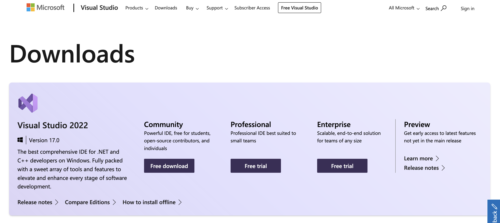
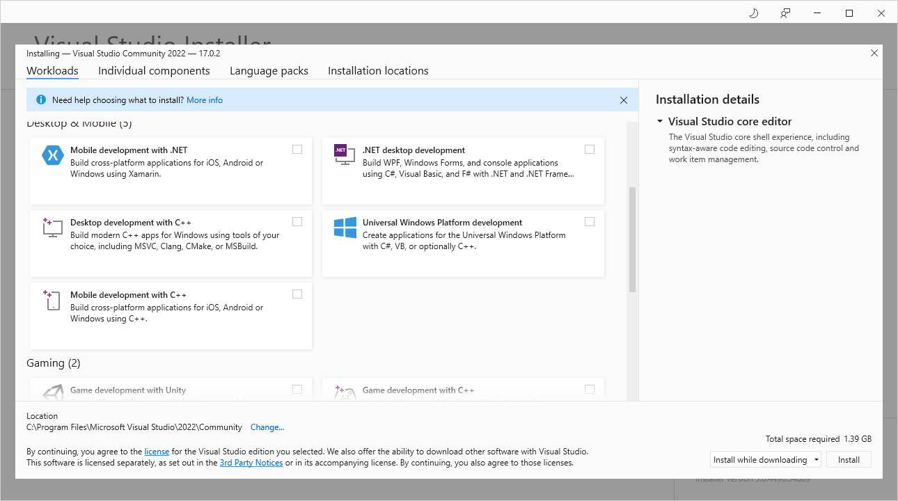
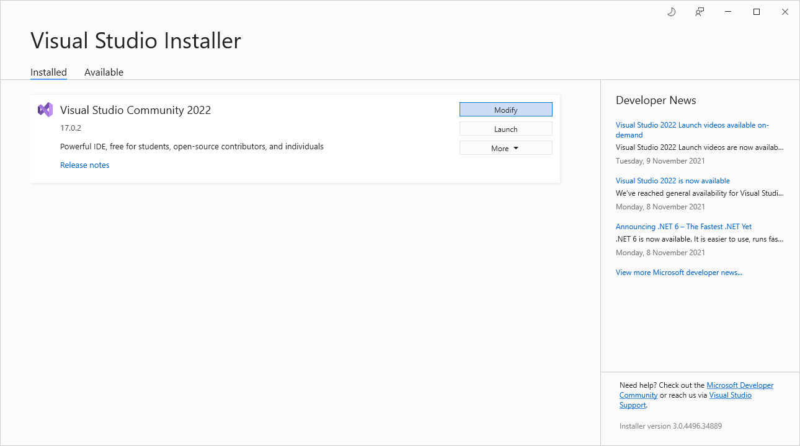
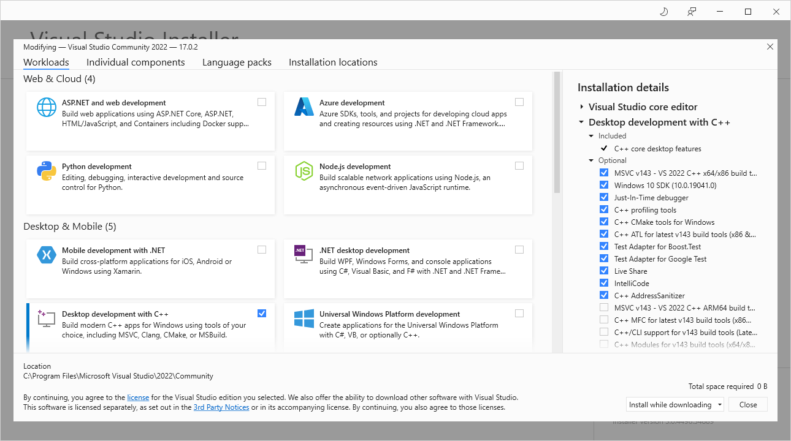

# Installing a suitable c/c++ compiler on windows

To build the PYME code from source one needs a suitable C/C++ compiler.

**Note**: Selecting the compiler for windows is a moving target. MS keeps changing its products and product availabilities over time (we are after "free" installs). We try to stay current but cannot guarantee things haven't changed a little by the time you read this. There are other options, like MinGW compilers etc but the MS compilers seem to achieve the highest compatibility for our purpose in practice.

On windows 10, until recently the [Microsoft Build Tools for Visual Studio 2019](https://www.visualstudio.com/downloads/#build-tools-for-visual-studio-2019), see below, were the default compiler of choice.

Since about December 2021, the link above instead leads to the general [Visual Studio Downloads page](https://visualstudio.microsoft.com/downloads/) which does not offer the VS 2019 tools anymore. At the original time of writing (early 2022), this looks as below:

## Visual Studio 2022 Community Install

We use the `Community - Free Download` from the [Visual Studio Downloads page](https://visualstudio.microsoft.com/downloads/).

Selecting the `Free Download` button loads an executable installer. Running that executable installer pulls in the actual Visual Studio Installer which offers selecting components to be installed. In the section `Desktop & Mobile` one can select `Desktop development with C++`, as shown below:

Once you select just this box and then start the actual install you are told the size of the installed components (I think it was ~9GB) and the download and install starts.

Wait for that to complete, then you presumable end up with this window (things keep changing over time with MS products - YMMV):

You can exit the installer here and are done.

If you click the `Modify` button you see this, which shows the installed components as below (in theory you could now select more components to be installed). We show it here only to illustrate the components that were installed.

At this stage you have a working compiler install and can start the build process.
